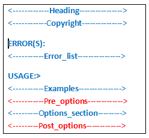

HelpText provide [[AutoBuild|M_CommandLine_Text_HelpText_AutoBuild__1]] method to generate help by passing the different options.

For example:

```cs
//1- disable auto generated help
var parser = new CommandLine.Parser(with => with.HelpWriter = null);

//2- run parser and get result
var parserResult = parser.ParseArguments<Options>(args);

//3- generate help based on result and parameters
var helpText = HelpText.AutoBuild(result, h =>
{
  //configure HelpText
  h.AdditionalNewLineAfterOption = false; //remove newline between options
  h.Heading = "Myapp 2.0.0-beta"; //change header
  h.Copyright = "Copyright (c) 2019 Global.com"; //change copyright text
  // more options ...
  return h;
}, e => e);

// 4- display help from with NotParsed method

result.WithNotParsed(errs => DisplayHelp(parserResult, errs));

//for complete example see example1 and example2
```

# HelpText layout

Help text is layout as in the following figure:



It's composed of the following sections:

- **Heading**: is formated as:   `<title> <version>`
  > Example: ConsoleApp2 1.0.0
- **Copyright**: is formatted as
  ```
  Copyright (C) `<year> <Company>`
  ```
  or in case of Copyright attribute available:
  ```
  <copyrightAssemblyAttribute>
  ```
  > Example: Copyright (C) 2019 ConsoleApp2
- **Examples**: Syntax of command use.
- **Options_section**: series of `<Shortname, longName>` with its help.
- **Pre_options**: is optional block before options.
- **Post_options**: is optional block after options.

# HelpText Setting

HelpText can be configured using the following Properties and methods.

| Name                         | Description                                                                                                                                         |
| ---------------------------- | --------------------------------------------------------------------------------------------------------------------------------------------------- |
| **Properties**               |
| AddDashesToOption            | Gets or sets a value indicating whether the format of options should contain dashes. It modifies behavior of AddOptions(T)(ParserResult(T)) method. |
| AddEnumValuesToHelpText      | Gets or sets a value indicating whether to add the values of an enum after the description of the specification.                                    |
| AdditionalNewLineAfterOption | Gets or sets a value indicating whether to add an additional line after the description of the specification.                                       |
| AutoHelp                     | Gets or sets a value indicating whether implicit option or verb 'help' should be supported.                                                         |
| AutoVersion                  | Gets or sets a value indicating whether implicit option or verb 'version' should be supported.                                                      |
| Copyright                    | Gets or sets the copyright string. You can directly assign a CopyrightInfo instance.                                                                |
| Heading                      | Gets or sets the heading string. You can directly assign a HeadingInfo instance.                                                                    |
| MaximumDisplayWidth          | Gets or sets the maximum width of the display. This determines word wrap when displaying the text.                                                  |
| **Methods**                  |
| AddPostOptionsLine           | Adds a text line at the bottom, after options usage string.                                                                                         |
| AddPostOptionsLines          | Adds text lines at the bottom, after options usage string.                                                                                          |
| AddPostOptionsText           | Adds a text block of lines at the bottom, after options usage string.                                                                               |
| AddPreOptionsLine(String)    | Adds a text line after copyright and before options usage strings.                                                                                  |
| AddPreOptionsLines           | Adds text lines after copyright and before options usage strings.                                                                                   |
| AddPreOptionsText            | Adds a text block of lines after copyright and before options usage strings.                                                                        |

# Example: 1

To use custom help, disable auto generating help by configuring Parser.HelpWriter= null.
Use `AutoBuild` method to build help.

This example configure HelpText with `AdditionalNewLineAfterOption`

```cs
static void Main1(string[] args)
{
  var parser = new CommandLine.Parser(with => with.HelpWriter = null);
  var parserResult = parser.ParseArguments<Options>(args);
  parserResult
    .WithParsed<Options>(options => Run(options))
    .WithNotParsed(errs => DisplayHelp(parserResult, errs));
}

static void DisplayHelp<T>(ParserResult<T> result, IEnumerable<Error> errs)
{
  var helpText = HelpText.AutoBuild(result, h =>
  {
    h.AdditionalNewLineAfterOption = false;
    h.Heading = "Myapp 2.0.0-beta"; //change header
    h.Copyright = "Copyright (c) 2019 Global.com"; //change copyright text
    return HelpText.DefaultParsingErrorsHandler(result, h);
  }, e => e);
  Console.WriteLine(helpText);
}
private static void Run(Options options)
{
  //do stuff
}
```

[](https://dotnetfiddle.net/8GgWPP)

Help is generated without a newline between options and setting heading and copyright text as displayed below:

```
Myapp 2.0.0-beta
Copyright (c) 2019 Global.com

  -r, --read         Input files to be processed.
  --verbose          (Default: false) Prints all messages to standard output.
  --stdin            (Default: false) Read from stdin
  -v, --version
  --help             Display this help screen.
  --version          Display version information.
  offset (pos. 0)    File offset.
```

In case of parsing errors, the help text include an  error section:

```
Myapp 2.0.0-beta
Copyright (c) 2019 Global.com

ERROR(S):
  Option 'zz' is unknown.

  -r, --read         Input files to be processed.
  --verbose          (Default: false) Prints all messages to standard output.
  --stdin            (Default: false) Read from stdin
  --help             Display this help screen.
  --version          Display version information.
  offset (pos. 0)    File offset.

```

# Example: 2

Control displaying help, version and errors based on the type of error using the extension methods: `IsVersion() or IsHelp()`

```cs
static void DisplayHelp<T>(ParserResult<T> result, IEnumerable<Error> errs)
{
  HelpText helpText = null;
  if (errs.IsVersion())  //check if error is version request
    helpText = HelpText.AutoBuild(result);
  else
  {
    helpText = HelpText.AutoBuild(result, h =>
    {
      //configure help
      h.AdditionalNewLineAfterOption = false;
      h.Heading = "Myapp 2.0.0-beta"; //change header
      h.Copyright = "Copyright (c) 2019 Global.com"; //change copyright text
      return HelpText.DefaultParsingErrorsHandler(result, h);
    }, e => e);
  }
  Console.WriteLine(helpText);
}
```

[](https://dotnetfiddle.net/fMVNMC)

# Example: 3

Adding dynamic contents computed at runtime.

```cs
//get environment variable
static Func<string> dynamicData = () => {
  var header = "-------Environment Variables----------";
  var windir = Environment.GetEnvironmentVariable("windir");
  return $"{header}\nwindir={windir}";
};

static void DisplayHelp<T>(ParserResult<T> result, IEnumerable<Error> errs)
{
  var helpText = HelpText.AutoBuild(result, h =>
  {
    h.AddPostOptionsLine(dynamicData());
    return h;
  }, e => e);
  Console.WriteLine(helpText);
}
```

Output

```
Myapp 2.0.0-beta
Copyright (c) 2019 Global.com

  -r, --read         Input files to be processed.
  --verbose          (Default: false) Prints all messages to standard output.
  --stdin            (Default: false) Read from stdin
  --help             Display this help screen.
  --version          Display version information.
  offset (pos. 0)    File offset.

-------Environment Variables----------
windir=C:\Windows
```

# Setting AssemblyInfo Attributes

HelpText retrieve AssemblyAttributes values to show header and copyright in help.
The next AssemblyAttributes should be set:

If you are using `AssemblyInfo.cs`, add the following lines:

```cs
[assembly: AssemblyTitle("Application Title")]
[assembly: AssemblyCompany("Company")]
[assembly: AssemblyCopyright("Copyright")]
[assembly: AssemblyInformationalVersion("1.0.0-beta")]
```

## An alternative method:

If you are not using `AssemblyInfo.cs`, Add these lines to the project file, just in PropertyGroup

```xml
<PropertyGroup>
...
  <Copyright>Copyright_text</Copyright>
  <Company>Company_text</Company>
  <Version>1.2.3-beta</Version>
  <AssemblyTitle>title_text</AssemblyTitle>

</PropertyGroup>
```

Modify the contents as your need.

The new SDK for `msbuild` is auto generating an `AssemblyInfo` file during build including the assemblyAttributes described above.

**Note:** This `PropertyGroup` is the same in `F#` projects `.fsproj` or `vb.net` project `.vbproj`

The version is retrieved from `AssemblyInformationalVersionAttribute`  or the `AssemblyVersionAttribute` if the former is not defined.

AssemblyInformationalVersionAttribute support [Semantic Versioning standard](https://semver.org/) like 1.0.0-beta, 1.0.0-beta.2, 1.0.0-beta.11,1.0.0-rc.1 and 1.0.0.

HelpText use these attributes by default to generate the heading text and copyright text.

Heading and copyright can be modified in custom help by changing the `Heading and Copyright` properties.

# See also

**HelpText API**, [[HelpText| T_CommandLine_Text_HelpText]]